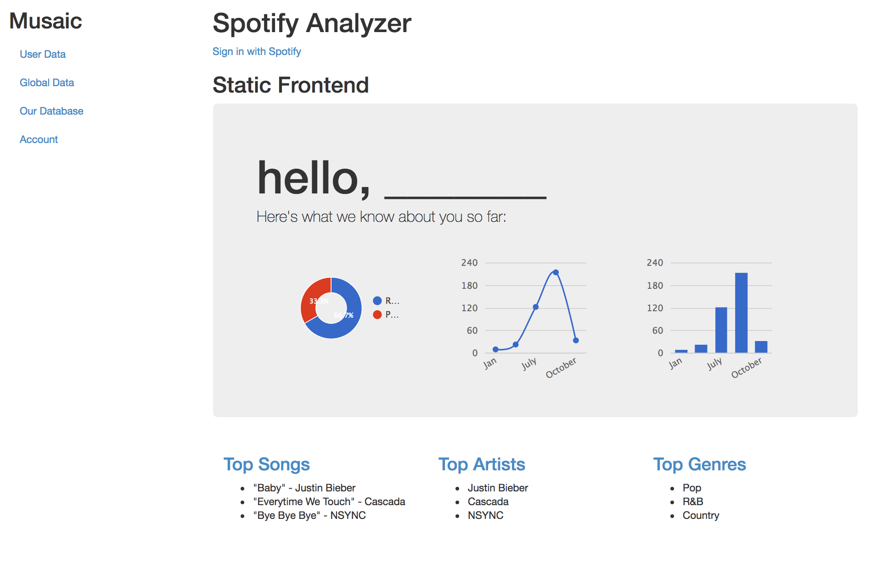
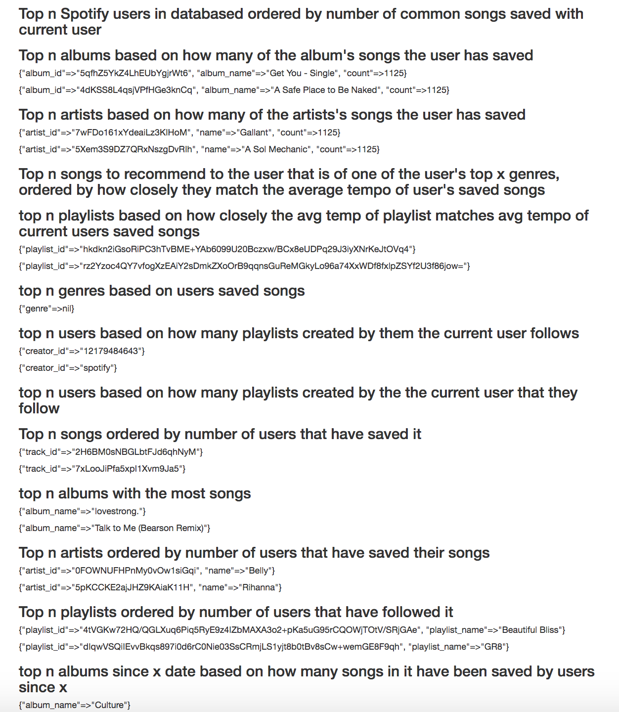

Project Checkpoint 2
=====================

##Progess: 
Implemented database schema, tested database, started designing website (frontend), Used spotify API (rspotify) to gather user info and insert specific data in db. Used user Spotify authentication system to let users sign into their accounts.

*Note: User must have Ruby, rbenv, postregesql, and Rails installed to run app. We recommend this resource: https://www.tutorialspoint.com/ruby-on-rails/rails-installation.html*

##Preview

##To Run: 

1. cd into spotify app 

2. run 'bundle install'

3. run 'rails s'

4. In browser open http://localhost:3000

4. click the link to sign in to spotify to populate the database and see query results

5. db under SpotifyApp/db/ populates with user info (local copy only, to be hosted on heroku)

##Roles:

* Emily: Designed new front end 
* Luke: Test Queries/ Queries for getting data from the database
* Nikhil: connecting to spotify api, getting data from spotify, adjusting queries 
* Sarah: Connecting to database, inserting from rspotify output to database, setting up rails routes, controller, models, and schemas
* Zach: connecting to spotify api, getting data from spotify

